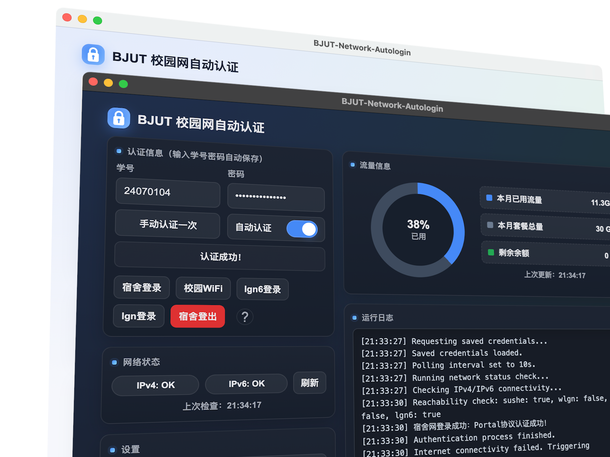

# BJUT-auto-login

北京工业大学(北工大)校园网自动登录

软件官网（文档也在网站上）：[https://quitsense.cn/apps/bjutautologin](https://quitsense.cn/apps/bjutautologin)

### 主要优点：
- 相比其他开源脚本，有现代的GUI
- 相比一些其他项目，有更好的跨平台能力
- 相比某些简易项目，使用系统加密库存储密钥，有更好的安全性
- 相比某些简易脚本，使用睡眠Hook trigger+长连接复用的自选间隔心跳包，耗电量更低
- 自带流量监测与设置面板，查看信息、配置更方便

> 「校园网已经自带无感知维护了，为什么要还要做自动登录？」
> 
> 因为它只维护ipv4，不维护ipv6，后者是免流必须的。维护后者很麻烦，要经常访问lgn6，而且很容易掉。

### Promotion

校园网ipv6免流：[https://quitsense.cn/apps/freeofcharge](https://quitsense.cn/apps/freeofcharge)

### Others

前端部分主要由AI完成

轮循模式的意义：bjut校园网很容易掉ipv6，轮询可以防止掉ipv6。实际上耗电不多，默认设置下是微信的十分之一不到。

<small>~~另外，我有玉玉症，不接受任何批判我垃圾commit习惯的批判~~</small>

Search Keywords Optimization: BJUT network autologin auto login script desktop app 宿舍 工位